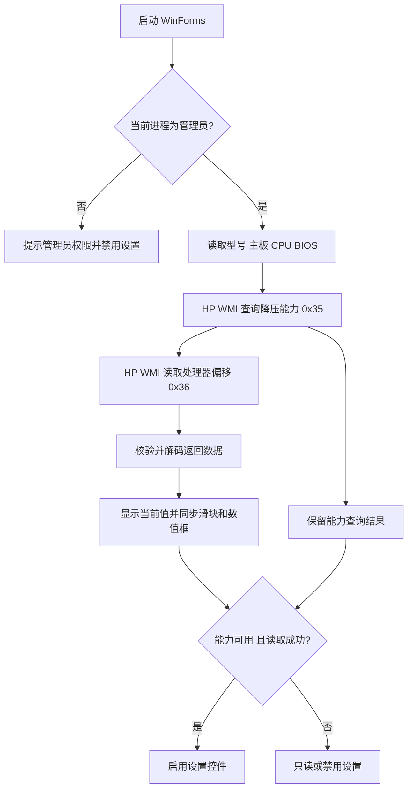

# 系统架构与运行流程

## 程序结构

这是一个 .NET Framework 4.8 x64 WinForms 应用，无第三方运行时包。界面、协议和 WMI 访问刻意拆成三个源码文件：

- `src/Program.cs`：启动 WinForms、绘制主窗口、读取标准 Windows WMI 设备信息、协调读取和写入流程、显示确认对话框及发起 Windows 重启。
- `src/SafetyProtocol.cs`：纯数据逻辑，包括降压能力码判断、UI 幅度映射和 BIOS 请求数据的编码／解码。
- `src/HpBiosWmi.cs`：连接 `root\wmi` 下的 HP `hpqBIntM`，调用 `hpqBIOSInt128`，并检查 BIOS 返回码。

图片与图标以嵌入资源形式编入程序，位于 `assets/`。`app.manifest` 配置程序清单，包括管理员执行级别和 DPI 感知设置。

界面只使用 WinForms 自带控件（分组框、标签、`TrackBar`、`NumericUpDown` 和系统按钮），配色沿用系统颜色，没有自绘控件、自定义主题或第三方 UI 库。

## 启动与读取

每次读取会先禁用设置控件，避免在状态不确定时操作。没有机型白名单，只有固件能力查询与偏移读取两道检查；两者都通过才允许写入。

## 写入与重启

1. 用户从滑块或数字框选择 `0–200 mV` 幅度；两个控件保持同步，目标显示为负偏移。
2. “应用设置”或“恢复 0 mV”都进入同一个写入函数，并显示默认选择“否”的二次确认。
3. `SafetyProtocol.EncodeOffset` 生成固定 128 字节请求；`HpBiosWmi` 使用 `0x37` 设置命令提交。
4. BIOS 返回码为零后，界面显示“已接受／待重启”，再让用户选择立即重启或稍后重启。
5. 立即重启调用 Windows `shutdown.exe /r /t 0`。重启后需重新打开工具读取，才能查看固件报告的当前值。

`0x37` 返回成功只表示接口报告请求成功，不等同于重启后偏移已生效或系统稳定。

